# TODOS
- Wo kommt der Dummy her?
- Looking for old stuff (alles mal am originalen Projekt durchgehen)


# Level Generator for Firefighter VR Training

This repository contains a prototype for a **level generator** used in a **virtual reality training** environment for firefighters. The goal of the project is to create a dynamic and random floor plan with rooms, corridors, fire, smoke, and injured persons to simulate realistic emergency situations for firefighter training.

## Table of Contents
- [Installation](#installation)
- [Usage](#usage)
- [Settings](#settings)
- [Algorithm Overview](#algorithm-overview)
- [Corridor and Room Elements](#corridor-and-room-elements)
- [Detailed Algorithm](#detailed-algorithm)

## Installation

1. Clone the repository:
   ```bash
   git clone https://github.com/Schwob42/LevelGenerator.git

2. Unity:mit Version und den Assets für Feuer, Rauch und dem Dummy...
 - The simulation was created with Unity (version 2022.3.17f1)
 - Assets that were used:
 	- [Free Fire VFX](https://assetstore.unity.com/packages/vfx/particles/fire-explosions/free-fire-vfx-266227) For Free

### Language
The primary language of the UI is German. The code is written and documented in English (mostly). 

### Branches
There are two branches:
  - MazeGenerator: The MazeGenerator is a version of [Maze2](https://catlikecoding.com/unity/tutorials/prototypes/maze-2/) where the whole game field should be used to render a maze.
  - LevelGenerator: The LevelGenerator is also based on this Algorithm, but COULD (no need) use the whole game field and can render paths (corridors) and rooms.  
Both branches have small ReadMes.

## Usage
  This VR training prototype is used to simulate environments where firefighters can practice navigating through random building layouts, responding to different emergency situations, and improving spatial awareness.
  - VR Simulation: Firefighters navigate through a smoke-filled building to simulate real-life emergency scenarios.
  - Dynamic Floor Generation: The system randomly generates rooms and corridors based on various parameters and user settings.

## Settings
  The user can adjust the following parameters for the environment generation:
  - Maximum depth and width of the floor (in meters).
  - Starting point for the algorithm (the access door to the floor).
  - Whether rooms and corridors should be generated or only one type.
  - Minimum number of corridor elements before a curve or intersection.
  - Probability for placing specific corridor elements (0-100%).
  - Room dimensions (in elements).
  - Option to use a seed to generate identical results.

## Algorithm Overview
The algorithm for generating the layout of the floor is based on a maze generation approach. It uses the following steps:
- Start with an empty floor grid and place the starting point.
- Use the random selection of corridor and room elements to populate the grid.
- Continuously check for conflicts in placement using Boolean operations.
- Optionally, rooms and obstacles can be placed in corridors.

## Corridor and Room Elements
The layout consists of several corridor and room types, including:
- Corridor elements: start and end, corridor, corridor with door, curve, T-junction, X-junction
<p float="left">
	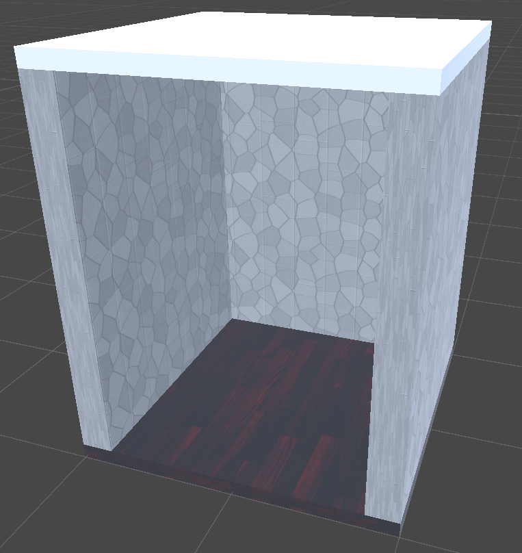
	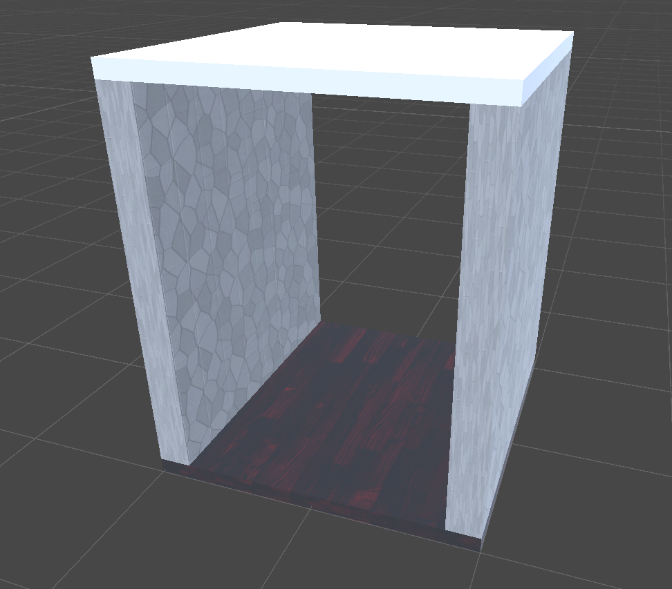
	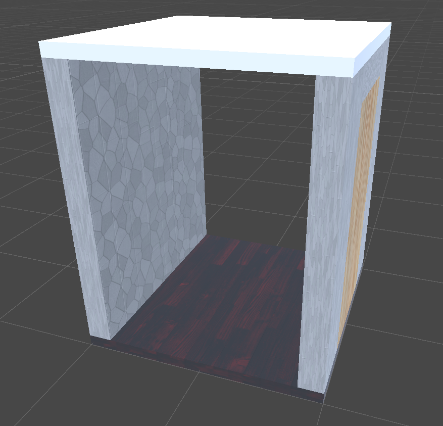
</p>
<p float="left">
	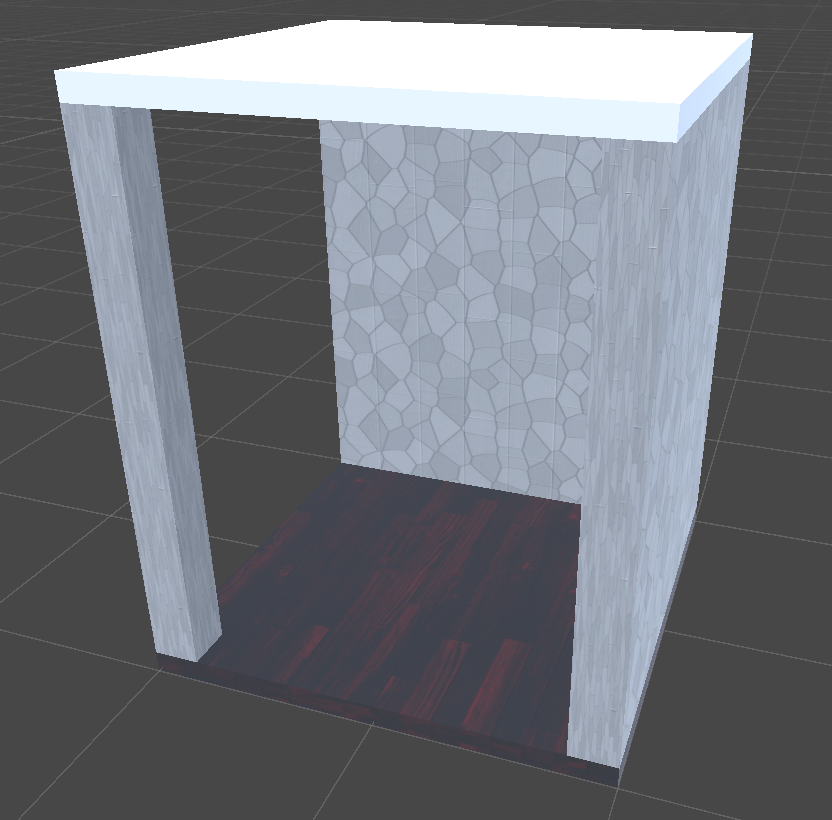
	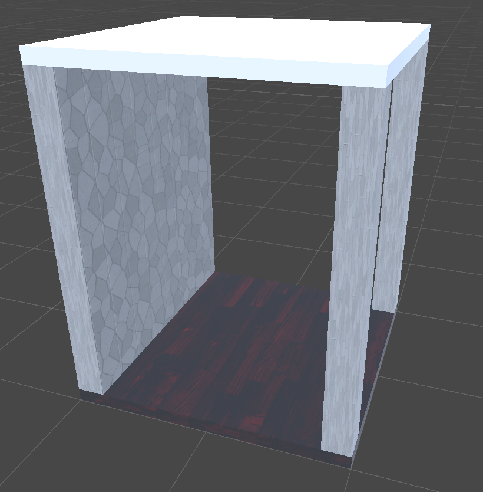
	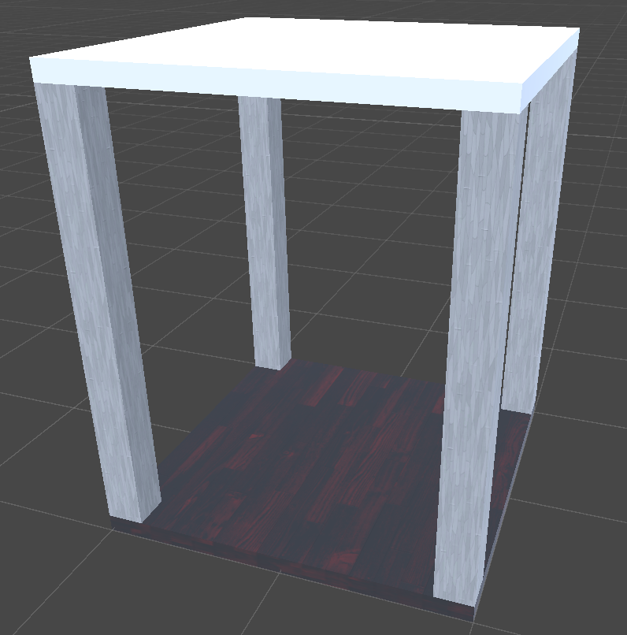
</p>

- Room elements: alcove, wall on one side, a wall with a door, walls on both sides, room corner, floor only

<p float="left">
	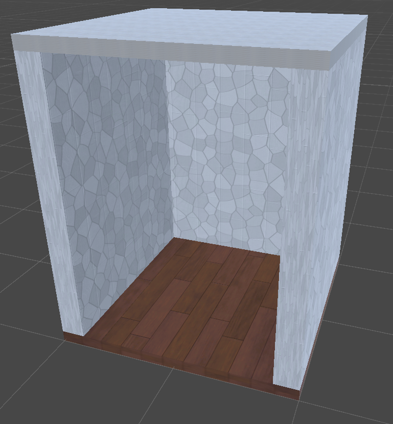
	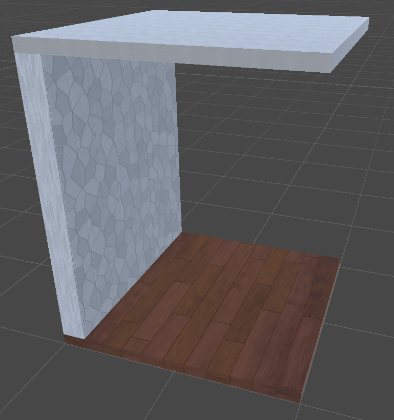
	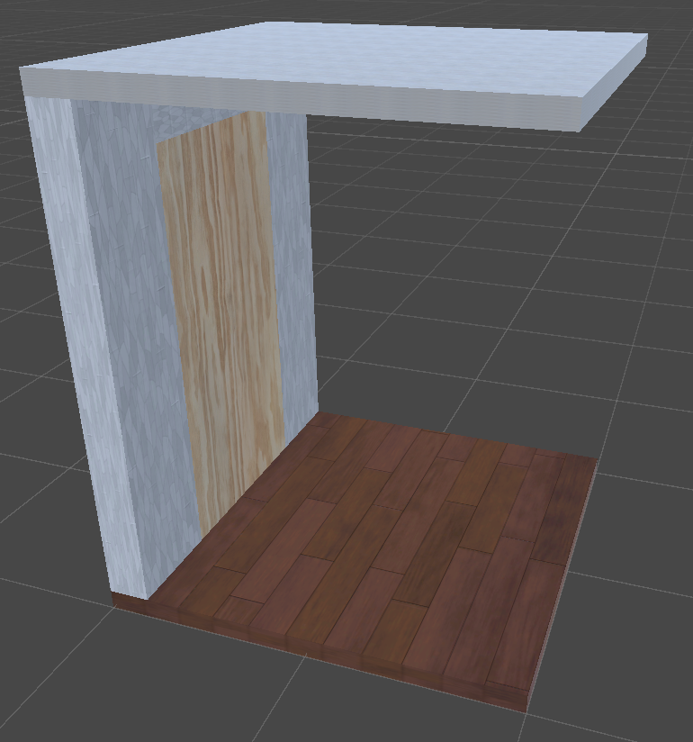
</p>
<p float="left">
	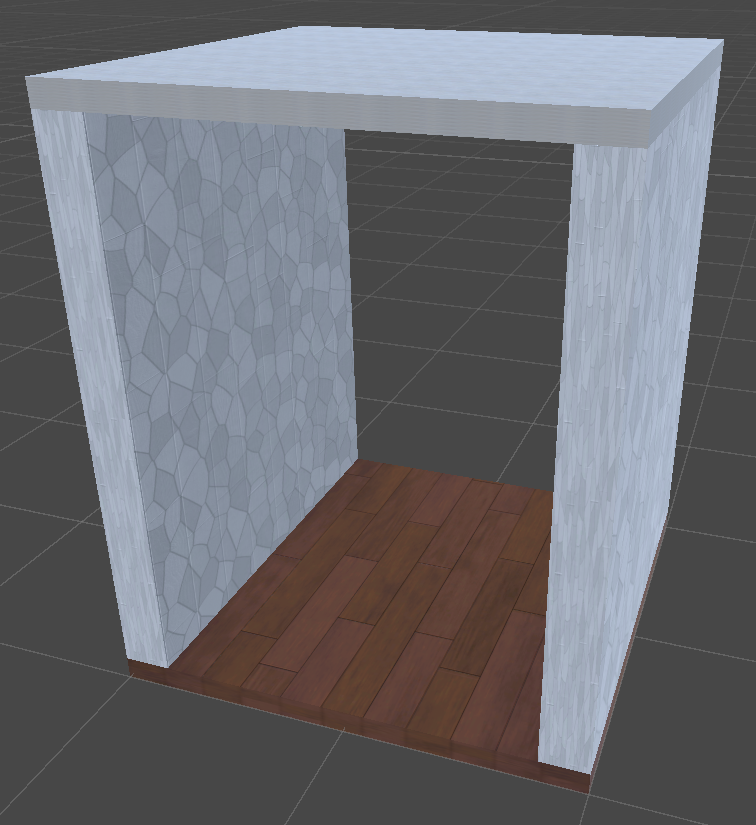
	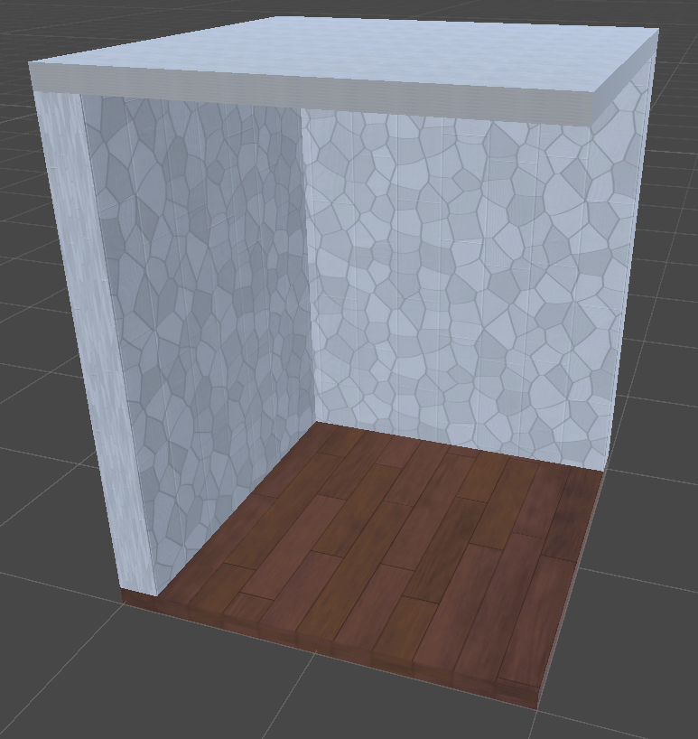
	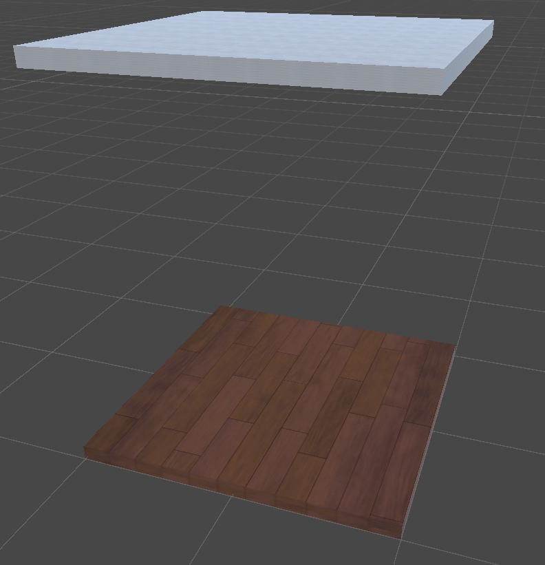
</p>

## Detailed Algorithm

The basic idea of the algorithm is based on the algorithm of [Maze2](https://catlikecoding.com/unity/tutorials/prototypes/maze-2/), which also creates a level with corridors but fills the entire possible space. Maze2 uses the entire possible space of the playing field to create a maze. The algorithm in this work can utilize the entire space but does not have to. In addition, rooms are generated at the corridors that are not generated in Maze2. At the beginning, an empty floor with the specified depth and width is created and divided into X by Y (specified by the user settings) cells. Each of these cells has four boolean attributes that indicate whether the passage to the cell in the respective direction is free (TRUE) or blocked (FALSE). Initially, this would be as in the example.
<p float="center">
	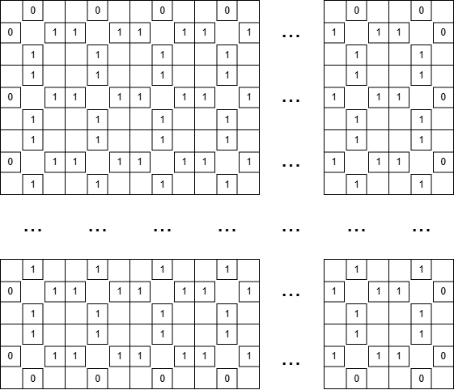
</p>
Once completed, a start element is placed at the start position. Then, the following steps are run through until all corridors have been completed.

<p float="left">
	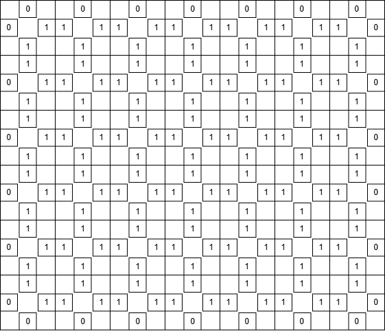
	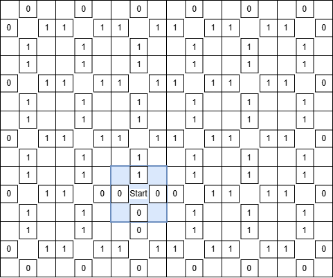
</p>
<p>
	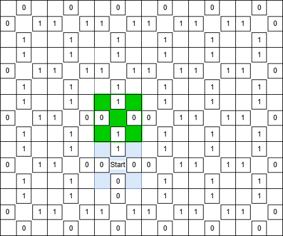
	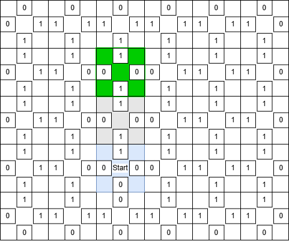
	<p>Sequence of the algorithm using a new cell field (top left) with setting the starting point (top right) and selecting the next cell to be occupied (bottom left) and the following cell (bottom right). The blue field signals the start field while green marks the selected field. Grey signals the generated path.</p>
</p>

### Step 1. Adjust Set and Surrounding Cells
After an element has been placed in a cell, the four boolean attributes are adjusted to update the information for walls or potential passages.
For each of these attributes, a logical (Boolean) AND of the Boolean of the original cell and the selected element is performed.
For example, this would be North: True && True = True, East: True && False = False, South: True && False = False, West: True && False = False. A logical AND of the neighboring cardinal points of adjacent cells is then performed. 

### Step 2. Find Suitable Neighboring Cells
If the cell just placed is an end, the recursive part ends at this point. The corridor or an arm of the corridor is then completed.
If the minimum number of consecutive corridors has not yet been reached, a corridor with or without a door is automatically taken and placed (possibly rotated) in the continuing direction. The algorithm then jumps back to step 1.
If none of the above cases apply, up to three neighboring cells are checked to see whether they are free and can be reached from the current cell (Boolean = True), starting from the cell that has just been placed.

### Step 3. Find a Suitable Element for The Cell
For each of the up to three cells that are considered suitable, a list of possible aisle elements is created that can be placed in this cell without aisles being blocked by adjacent walls. Under certain circumstances, such as collisions with surrounding fields or open passages that would lead outside the playing field, the aisle elements are rotated several times to check their placement. One of the aisle elements is then selected and placed from the list of elements with the probabilities specified by the user. If the selected element has a door, the next step follows. Otherwise, the algorithm starts recursively at step 1.

### Step 4. Creating a Room
If an aisle element has a door, the algorithm attempts to create a room behind this door. As success cannot be guaranteed because, for example, a room would have to be generated outside the playing field or because another corridor element has already been placed behind the door, the algorithm may subsequently remove the door so that the same corridor element has been placed without the door.
A room is created recursively, similar to an aisle. The algorithm attempts to create a room that is as large as possible and meets the user's settings as closely as possible. A room can be smaller but not larger than the user specification.

### Deviations of The algorithm from The User Settings#
As corridors and rooms are generated randomly, it may happen that the algorithm cannot add a corridor element to a cell without contradicting the user's settings. For example, an intersection might be placed at an aisle to which a curve, T-junction, or an end must be placed immediately so that the maximum width of the floor is not exceeded. If the user has specified that an aisle must consist of at least three consecutive corridors before another element can be selected, this leads to a contradiction. At this point, the algorithm marks the problematic cell so that it is considered <I>filled</I> but remains empty for the moment and adds it to an internal list for later revision. When the algorithm has completed all steps, for each cell in this list, an aisle element is now selected that fits exactly into the cell without looking at new cells, regardless of the user settings. In the example, this could be an end.

<p float="center">
	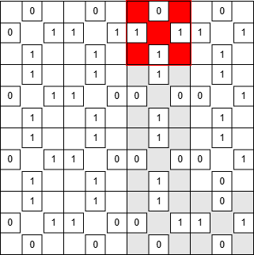
	<p>Problematic cell that must be given a corridor (due to the user setting of at least three corridors), but cannot, as this would lead to a path to nowhere (end of the world). The previous path is marked in gray.</p>
</p>

