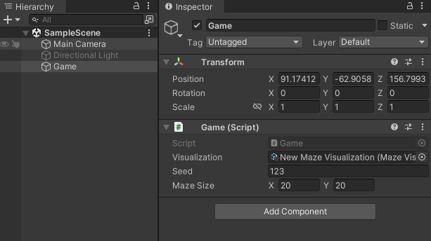

# Mazegenerator

This Generator based on [Maze2](https://catlikecoding.com/unity/tutorials/prototypes/maze-2/) generates on "play" a maze. You can make a few configurations for the maze. At the scene, you can find the gameObject "Game".

	

Here, you can configure the width and height of the maze. If you want to generate a maze that can be recreated with the same settings, you can also set a seed.
