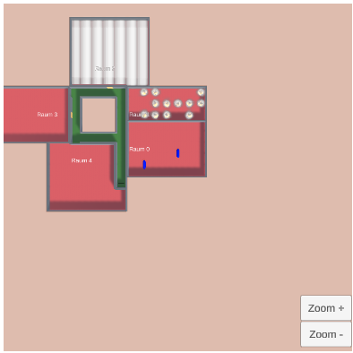

# Level Generator

At first: This is only a prototype. So this project is not as pretty as it should be. There are no tests, no fancy UI, and there are also bugs!

## Using the generator
1. Start the scene "Main". Here, you can choose between "Generator" and "Simulation".
2. First, select "Generator" to configure the settings according to your preferences.
3. The interface is divided into two sections:
	- Left Side: A top-down view of the game field (initially empty).
	- Right Side: A menu where you can switch between Settings and Placement (blue).
4. Depending on your selection, additional options (orange) will appear, allowing for further customization.

### General settings
Here, you can choose whether the algorithm should generate only paths, only rooms, or both. Additionally, you can customize the game field by setting its width, height, starting coordinates, and a seed for generation.

	

### Path settings
Here, you can configure the probabilities of different path elements, as described in the Main-ReadMe. The sum of the probabilities must be 100%. Additionally, you can set the minimum corridor length before a curve, dead end, or intersection. 

	

### Room Settings
Here, you can configure the probability for generating a room, maximum width, and depth of a room. The algorithm tries to generate a room, that is as big as possible but smaller than your settings.

	

### Placement Settings
At the placement settings, you can place fire, smoke, and people into the room. Therefore you select the room via dropdown and press the button on the right.  
For smoke, the whole room will be filled with smoke. For fire, only random fire will be placed in the room. For a person, only one person (per click) will be placed at a random place in the selected room.

	

### Example
Here, you can see an example where I placed smoke in room 2, fire in room 1, and two persons in room 0. You also could combine fire, smoke, and people in one or more rooms.

	

